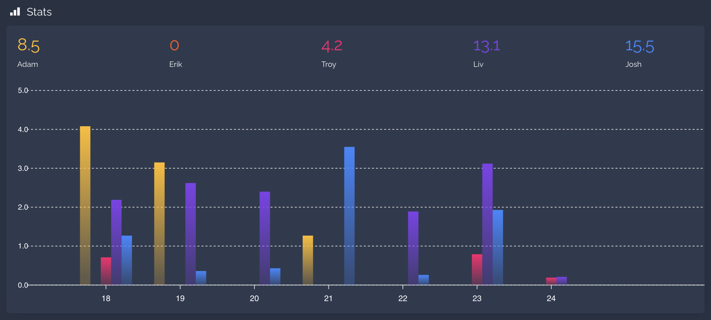
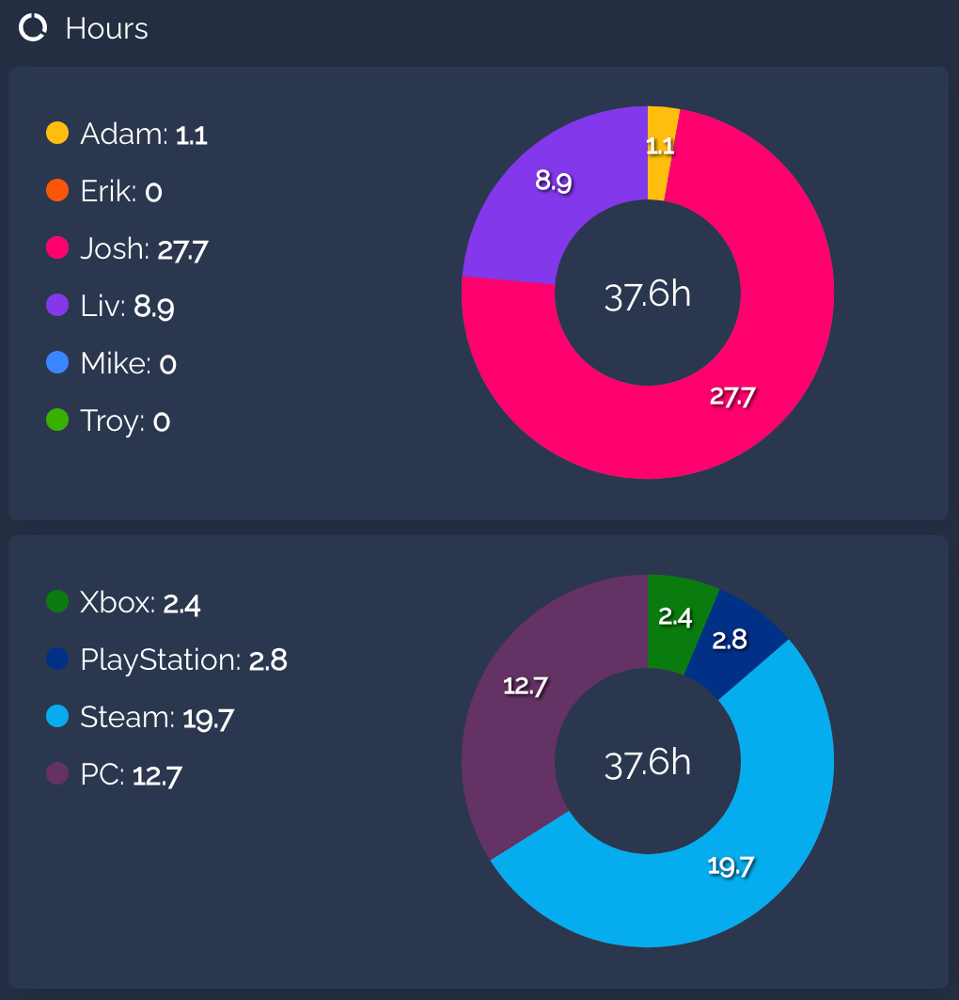
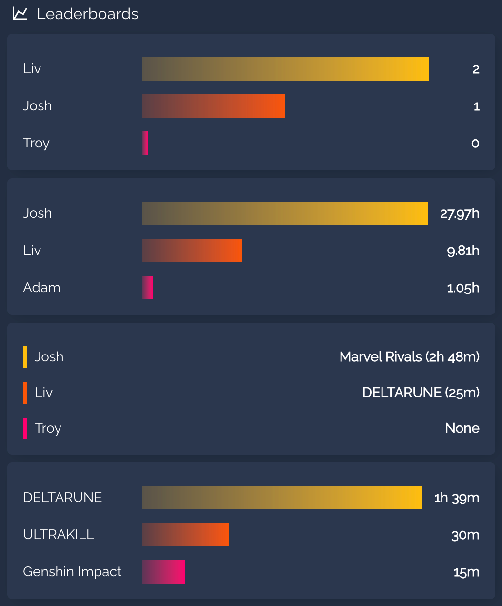

# 🎮 Gaming Status Cards for Home Assistant

A collection of beautiful, highly customizable dashboard cards designed specifically to work with the **[Gaming Status Integration](https://github.com/adamjthompson/Gaming-Status)**.

This plugin includes five unique cards to visualize your squad's gaming habits: a clean **List Card**, a dynamic CSS-animated **Slideshow Card**, a historical **Chart Card**, a platform **Donut Card**, and a **Leaderboard Card**.

**Best of all: Zero YAML required.** All cards feature a complete visual UI editor right inside Home Assistant!

---

## 📦 Installation

This card is designed to be installed via [HACS](https://hacs.xyz/).

1. Open HACS in your Home Assistant instance.
2. Click the three dots in the top right corner and select **Custom repositories**.
3. Paste the URL of this repository.
4. Select **Dashboard** as the category and click **Add**.
5. Click on the new **Gaming Status Cards** integration and hit **Download**.
6. When prompted, reload your browser cache.

---

## 🛠️ The Cards

When you edit a dashboard and click **Add Card**, you will now see five new options at the bottom of your card picker.

### 1. Gaming Status - List
A clean, native-feeling list of your tracked gamers. It dynamically tints the card backgrounds based on the active platform and gracefully handles offline states.

**UI Configuration Options:**
* **Mode:** Choose who to show. Show everyone, strictly online players, or filter by a specific platform (PC, Custom, Discord, Steam, Xbox, PlayStation).
* **Color Mode:** Select border and background fade colors based on the game's dominant color or the platform color.
* **Sort By:** Automatically sorts players chronologically by who was `Last Online`. Actively online players are always pinned to the top. Can also be sorted alphabetically by Name or Game Title.
* **Visibility:** Toggle the platform icon badges and text shadows to fit your dashboard theme.
* **Maximum Visible Players:** Limit how many players will be shown at once before a scrollbar is displayed.

**Online Now**


**Recent Players**


**Platform-Specific**


---

### 2. Gaming Status - Slideshow
A dynamic, CSS-animated slideshow that cycles through the high-resolution cover art of currently active games and media.

**UI Configuration Options:**
* **Artwork Type:** Choose which art style to display — Hero (wide landscape), Cover/Grid (portrait), Logo (transparent title art), or Icon (small square).
* **Aspect Ratio Override:** Manually define the card's dimensions (e.g., `3840/1240`, `16/9`, `1/1`). Leave blank to automatically use the default ratio for the selected artwork style.
* **Timing Controls:** Set the exact number of seconds each slide displays, and how long the crossfade transition takes.
* **Player Avatars:** Automatically superimposes the avatar of the person playing the game into the bottom right corner.
* **Auto-Hide:** Automatically hides the entire card from your dashboard if no one is currently playing a game, saving valuable screen real estate.
* **Include Plex/Tautulli:** Optionally pull in active media sessions from your Plex server. *(Note: This feature requires the [Tautulli custom integration](https://github.com/custom-components/tautulli) to be installed and configured to generate session sensors).*

**Slideshow with Player Avatars**


---

### 3. Gaming Status - Chart
An automated wrapper that builds a beautiful rolling 7-day historical chart of your gamers' habits.

*⚠️ **Note:** This card requires the popular [apexcharts-card](https://github.com/RomRider/apexcharts-card) to be installed via HACS.*

**UI Configuration Options:**
* **Automated Setup:** Automatically grabs all your gamers and assigns them distinct, vibrant colors on the chart with zero configuration.
* **Custom Colors:** Override the default palette with a comma-separated list of CSS colors (e.g., `#ffbe0b, rgb(251, 86, 7), blue`).

**Weekly Stats Chart**


---

### 4. Gaming Status - Donut
An ApexCharts-powered donut chart for visualizing platform usage or per-player hours across your squad.

*⚠️ **Note:** This card requires the popular [apexcharts-card](https://github.com/RomRider/apexcharts-card) to be installed via HACS.*

**UI Configuration Options:**
* **Chart Metric:** Choose what the donut visualizes. **Platform Split** breaks down total weekly hours across Xbox, PlayStation, and PC. **Most Played Hours (By Player)** shows a slice per player.
* **Time Window:** Choose the time period to display - **Rolling (Past 7 Days)** or **Calendar (Since Sunday)**
* **Player Filter Mode:** Show all tracked players, a single selected player, or a custom subset of players.
* **Custom Colors:** Leave blank to use native platform brand colors (in Platform Split mode) or the default vibrant palette. Override with a comma-separated list of CSS colors.

**Donut Chart**


---

### 5. Gaming Status - Leaderboard
A dependency-free native CSS bar chart that ranks your squad across a variety of gaming metrics. No ApexCharts required.

**UI Configuration Options:**
* **Leaderboard Metric:** Choose what stat to rank players by:
  * **Most Played Hours (Weekly)** — who logged the most time this week.
  * **Longest Gaming Session** — who had the single longest unbroken session.
  * **Most Different Games Played** — who has the broadest taste.
  * **Top Games: Hours Per Game (Aggregate)** — ranks games instead of players, showing which titles consumed the most time across your whole squad.
* **Time Window:** Choose the time period to display - **Rolling (Past 7 Days)** or **Calendar (Since Sunday)**
* **Player Filter Mode:** Show all tracked players, a single selected player, or a custom subset of players.
* **Items to Display (Rows):** Set how many ranked entries are shown (default: 3, max: 20).
* **Custom Colors:** Override the default vibrant palette with a comma-separated list of CSS colors.

**Leaderboard**


---

## ⚙️ Advanced Configuration (Manual Entities)

By default, all cards are entirely plug-and-play. They automatically scan your Home Assistant instance for any sensors generated by the Gaming Status integration (and Tautulli, if enabled) and populate the UI.

If you track a large number of people but only want to display a select few on a specific dashboard, every card features a **Manual Entities** override. Simply enter a comma-separated list of the exact Entity IDs you want to track in the visual editor's Advanced section.

**How Manual Entities interact with Plex (Slideshow card):**
* **To restrict both gamers AND Plex sessions:** Turn the "Include Plex" toggle **OFF**, and manually type out only the gamers and Plex session sensors you want to see (e.g., `sensor.adam_gaming_status, sensor.plex_session_1_tautulli`). The card will automatically format the Tautulli text bubbles correctly.
* **To restrict gamers but show ALL Plex sessions:** Type your specific gamers into the Manual Entities box, and turn the "Include Plex" toggle **ON**. The card will restrict the gaming sensors to your list, but automatically sweep up every active Plex session on your network.

---

## 📝 YAML Reference
For advanced users who prefer to write YAML, here are the base configurations for each card:

**The List Card:**
```yaml
type: custom:gaming-status-card
title: The Squad # Can be left blank to omit the title
mode: all # Options: all, online, pc, custom, discord, steam, xbox, playstation
sort_by: last_online # Options: last_online, name, state
show_badges: true
show_text_shadow: true
color_mode: platform # Options: platform, game
max_visible_players: " " # Limit visible rows before scrollbar appears
manual_entities: " " # Whitelist of comma-separated sensor names
```

**The Slideshow Card:**
```yaml
type: custom:gaming-slideshow-card
artwork_type: hero # Options: hero, cover, logo, icon
aspect_ratio: " " # Leave blank to use the default for your artwork type
time_per_slide: 5 # Display time for each slide (seconds)
transition_time: 1 # Transition time (seconds)
show_avatars: true
auto_hide: true
include_plex: false
manual_entities: " " # Whitelist of comma-separated sensor names
```

**The Chart Card:**
```yaml
type: custom:gaming-status-chart-card
title: Weekly Playtime
manual_entities: " " # Whitelist of comma-separated sensor names
custom_colors: "#ffbe0b, #fb5607, #ff006e" # Override the default colors
```

**The Donut Card:**
```yaml
type: custom:gaming-status-donut-card
title: Platform Split
metric: platforms # Options: platforms, hours
window: rolling # Options: rolling, calendar
mode: all # Options: all, selected (single is only available with the hours metric)
selected_entities: " " # Comma-separated sensor names (used when mode is 'selected')
custom_colors: " " # Override the default colors
```

**The Leaderboard Card:**
```yaml
type: custom:gaming-status-leaderboard-card
title: Gaming Leaderboard
metric: hours # Options: hours, longest, games, game_hours
window: rolling # Options: rolling, calendar
mode: all # Options: all, single, selected
single_entity: " " # A single sensor ID (used when mode is 'single')
selected_entities: " " # Comma-separated sensor names (used when mode is 'selected')
max_players: 3 # Number of ranked rows to display
custom_colors: " " # Override the default colors
```