# Gaming Status Cards for Home Assistant

A collection of beautiful, highly customizable dashboard cards designed specifically to work with the **[Gaming Status Integration](https://github.com/adamjthompson/Gaming-Status)**.

This plugin includes eight unique cards to visualize (and manage) your squad's gaming habits: a clean **List Card**, a dynamic CSS-animated **Slideshow Card**, a player-based **Weekly Hours Card**, a platform **Platforms Card**, a **Leaderboard Card**, a game-based **Weekly Games Card**, a session-by-session **Recent Sessions Card**, and a **Game Management Card** for cleaning up mislabeled or unwanted history.

**Best of all: Zero YAML required.** All cards feature a complete visual UI editor right inside Home Assistant!

---

## Installation

This card is designed to be installed via [HACS](https://hacs.xyz/).

1. Open HACS in your Home Assistant instance.
2. Click the three dots in the top right corner and select **Custom repositories**.
3. Paste the URL of this repository.
4. Select **Dashboard** as the category and click **Add**.
5. Click on the new **Gaming Status Cards** integration and hit **Download**.
6. When prompted, reload your browser cache.

---

## The Cards

When you edit a dashboard and click **Add Card**, you will now see eight new options at the bottom of your card picker.

### 1. Gaming Status - List
A clean, native-feeling list of your tracked gamers. It dynamically tints the card backgrounds based on the active platform and gracefully handles offline states.

**UI Configuration Options:**
* **Mode:** Choose who to show. Show everyone, strictly online players, or filter by a specific platform (PC, Custom, Discord, Steam, Xbox, PlayStation, Playnite).
* **Color Mode:** Select border and background fade colors based on the game's dominant color or the platform color. The "Game Artwork (Dynamic)" option is hidden (and the platform color is used automatically) if **Enable Game Color Extraction** is turned off in the integration's Global Settings, since no game color would ever be available.
* **Offline Image Style:** Choose whether offline players display their last played game's artwork or their player avatar.
* **Sort By:** Automatically sorts players chronologically by who was `Last Online`. Actively online players are always pinned to the top. Can also be sorted alphabetically by Name or Game Title.
* **Visibility:** Toggle the platform icon badges and text shadows to fit your dashboard theme.
* **Maximum Visible Players:** Limit how many players will be shown at once before a scrollbar is displayed.

**Online Now**
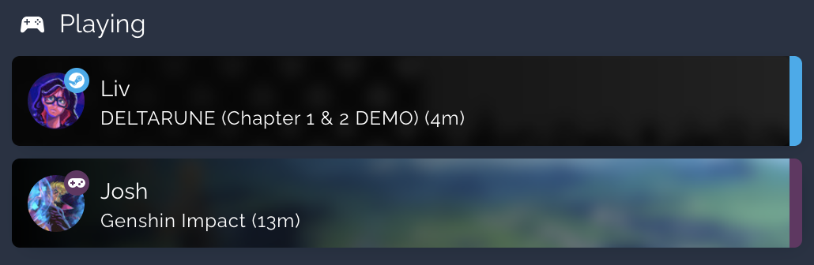

**Recent Players**
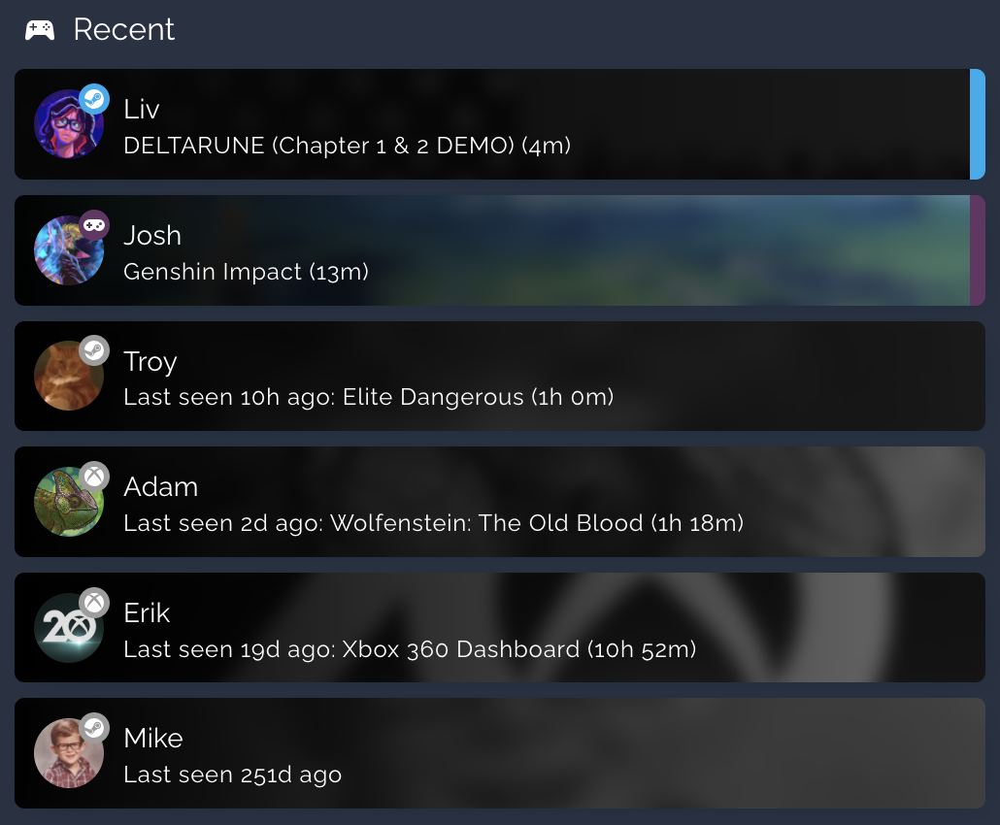

**Platform-Specific**
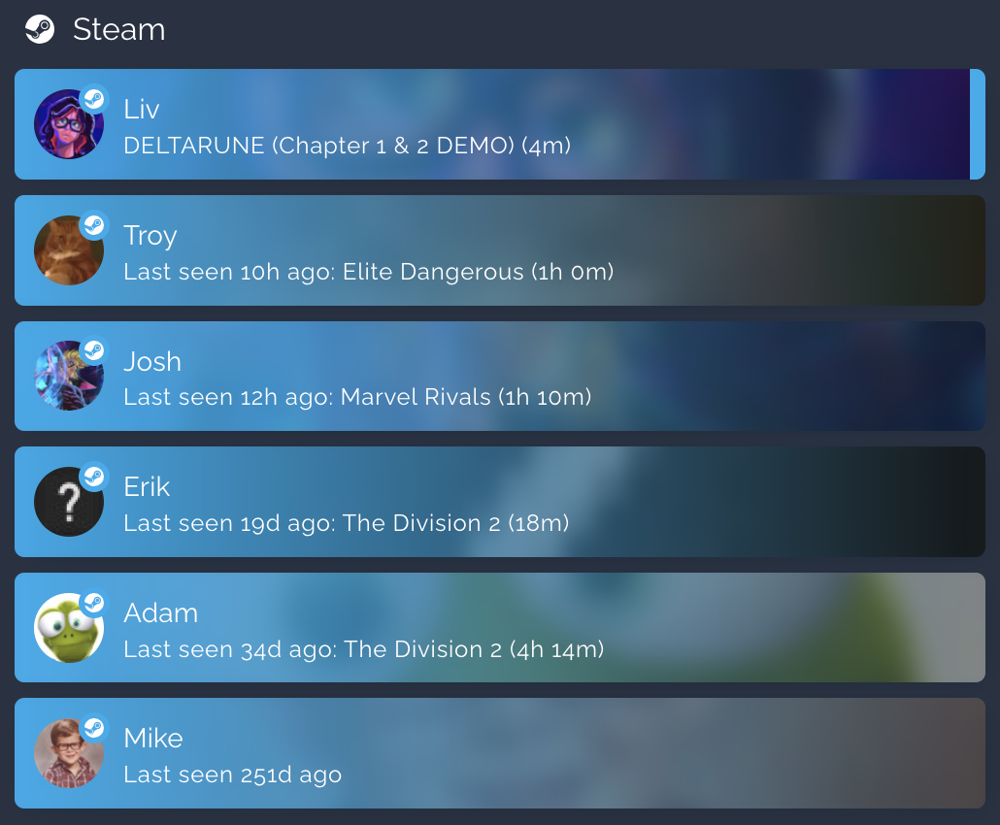

---

### 2. Gaming Status - Slideshow
A dynamic, CSS-animated slideshow that cycles through the high-resolution cover art of currently active games and media.

**UI Configuration Options:**
* **Artwork Type:** Choose which art style to display: Hero (wide landscape), Cover/Grid (portrait), Logo (transparent title art), or Icon (small square).
* **Aspect Ratio Override:** Manually define the card's dimensions (e.g., `3840/1240`, `16/9`, `1/1`). Leave blank to automatically use the default ratio for the selected artwork style.
* **Timing Controls:** Set the exact number of seconds each slide displays, and how long the crossfade transition takes.
* **Player Avatars:** Automatically superimposes the avatar of the person playing the game into the bottom right corner.
* **Auto-Hide:** Automatically hides the entire card from your dashboard if no one is currently playing a game, saving valuable screen real estate.
* **Plex Integration:** Optionally pull in active media sessions from your Plex server. Choose **None**, **Plex (media_player)** for the [native Plex integration](https://www.home-assistant.io/integrations/plex/), or **Tautulli (sensor)** for Tautulli session sensors. *(The Tautulli option requires the [Tautulli Active Streams integration](https://github.com/Richardvaio/Tautulli_Active_Streams) to be installed and configured).*

**Slideshow with Player Avatars**
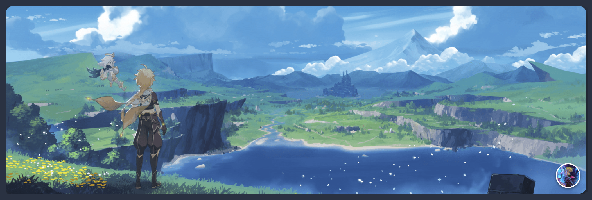

---

### 3. Gaming Status - Weekly Hours
A native SVG stacked bar chart showing each player's daily gaming hours across a rolling 7-day window.

**UI Configuration Options:**
* **Chart Title:** Optional title displayed above the chart.
* **Time Window:** Choose the time period to display: **Rolling (Past 7 Days)** or **Calendar (Since Sunday)**.
* **Player Filter:** Show all tracked players, a single selected player, or a custom subset of players.
* **Custom Colors:** Override the default vibrant palette with a comma-separated list of CSS colors (e.g., `#ffbe0b, rgb(251, 86, 7), blue`).
* **Legend:** Toggle the player legend below the chart on or off. Hiding it reclaims the legend area and gives the chart more vertical space. Defaults to on.
* **Exclusions:** When enabled, players with no hours in the selected time window are excluded from both the chart and the legend. Useful for squads where not everyone plays every week. Defaults to off.

**Weekly Hours Chart**
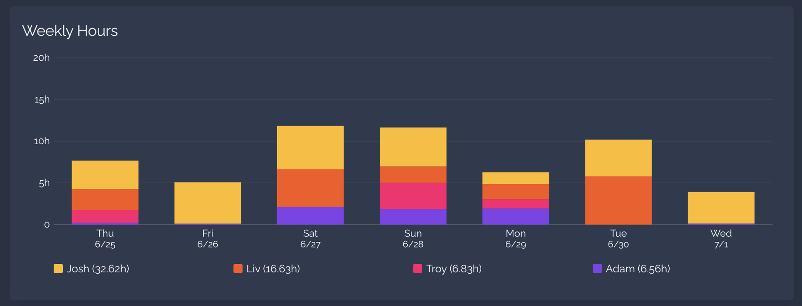

---

### 4. Gaming Status - Platforms
A native SVG stacked bar chart for visualizing platform usage across your squad.

**UI Configuration Options:**
* **Card Title:** Optional title displayed above the chart.
* **Time Window:** Choose the time period to display: **Rolling (Past 7 Days)** or **Calendar (Since Sunday)**.
* **Player Filter:** Show all tracked players, a single selected player, or a custom subset of players.
* **Custom Colors:** Leave blank to use native platform brand colors (Xbox green, PlayStation blue, PC teal). Override with a comma-separated list of CSS colors.
* **Legend:** Toggle the platform legend below the bar on or off. The legend automatically wraps to multiple rows on narrow screens. Defaults to on.
* **Total:** Toggle the grand total playtime line below the legend on or off. Defaults to on.

**Platform Split**
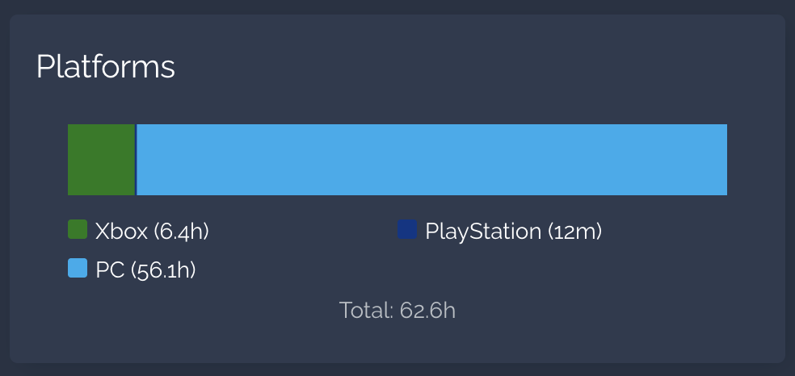

---

### 5. Gaming Status - Leaderboard
A dependency-free native CSS bar chart that ranks your squad across a variety of gaming metrics.

**UI Configuration Options:**
* **Leaderboard Metric:** Choose what stat to rank players by:
  * **Most Played Hours (Weekly)** - who logged the most time this week.
  * **Longest Gaming Session** - who had the single longest unbroken session.
  * **Most Different Games Played** - who has the broadest taste.
  * **Top Games: Hours Per Game (Aggregate)** - ranks games instead of players, showing which titles consumed the most time across your whole squad this week.
  * **All-Time Total Hours** — ranks players by their entire lifetime tracked playtime, not just the current window.
  * **All-Time Session Count** - ranks players by how many completed sessions they've logged, ever.
  * **Top Games: All-Time Hours Per Game (Aggregate)** - like the weekly version, but ranks games by lifetime hours across your whole squad.
* **Time Window:** Choose the time period to display: **Rolling (Past 7 Days)** or **Calendar (Since Sunday)**. Automatically hidden when an All-Time metric is selected, since those aren't scoped to a window.
* **Player Filter:** Show all tracked players, a single selected player, or a custom subset of players.
* **Items to Display (Rows):** Set how many ranked entries are shown (default: 3, max: 20).
* **Custom Colors:** Override the default vibrant palette with a comma-separated list of CSS colors.

**Leaderboard Cards**
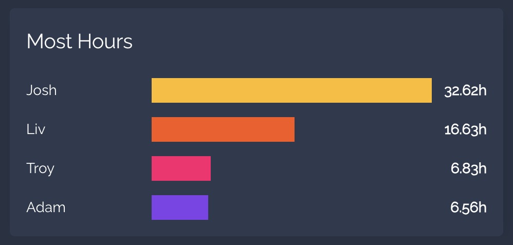

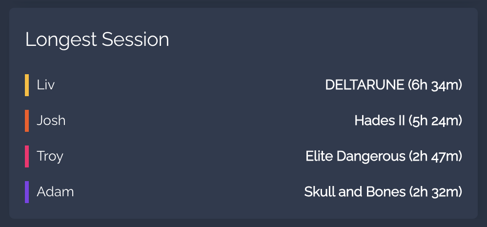

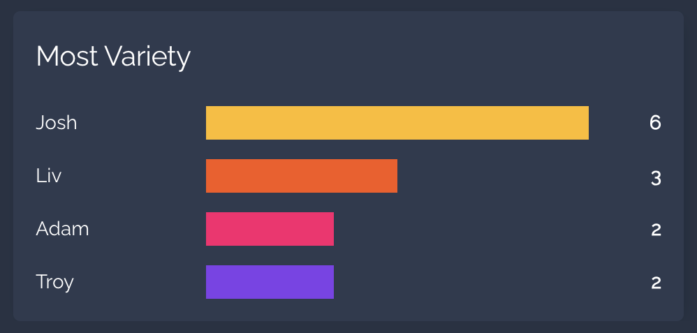

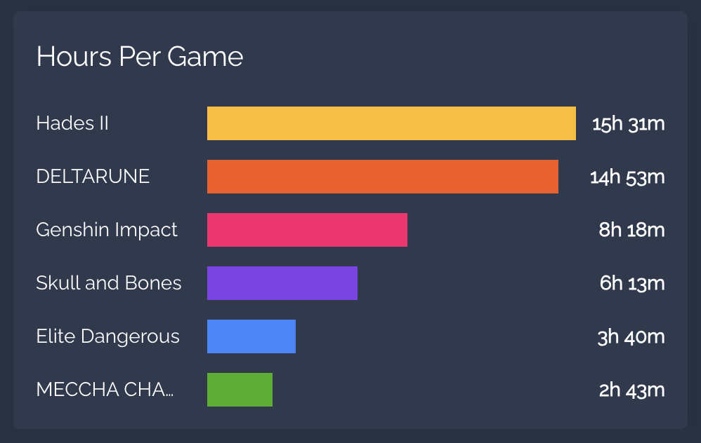
---

### 6. Gaming Status - Weekly Games
A native SVG stacked bar chart showing daily gaming hours broken down by individual game title. Aggregates playtime across all selected players.

**UI Configuration Options:**
* **Chart Title:** Optional title displayed above the chart.
* **Player Filter:** Show all tracked players, a single selected player, or a custom subset of players.
* **Time Window:** Choose the time period to display — **Rolling (Past 7 Days)** or **Calendar (Since Sunday)**.
* **Max Games to Display:** Ranks games by total hours and shows the top N titles (default: 6, max: 20).
* **Custom Colors:** Override the default palette with a comma-separated list of CSS colors.
* **Legend:** Toggle the game title legend below the chart on or off. Column count adjusts automatically based on available width and title lengths. Defaults to on.

**Weekly Games Chart**
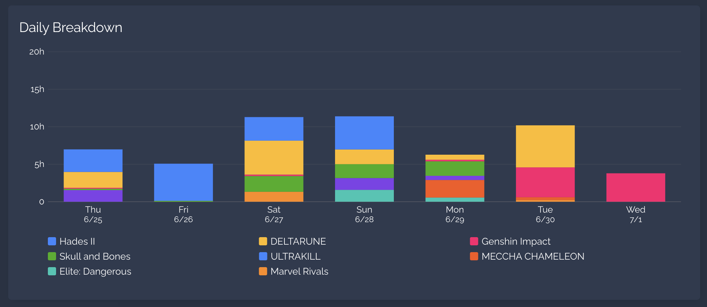

---

### 7. Gaming Status - Recent Sessions
A configurable table of recently completed play sessions (one row per session, newest first) with optional blurred artwork behind each row.

**UI Configuration Options:**
* **Card Title:** Optional title displayed above the table.
* **Platforms:** Independently check/uncheck Steam, Xbox, PlayStation, Playnite, Custom, and Discord to only show sessions from selected platforms.
* **Player Filter:** Show all tracked players, a single selected player, or a custom subset of players. In **Single Player** mode, the Player column is automatically hidden since it would be redundant.
* **Number of Sessions to Display:** How many recent sessions to show (default: 10, max: 20). If more than 10 would be shown, the list scrolls instead of growing taller. Type a value and click **Apply** to confirm it.
* **Background:** Choose what renders (blurred) behind each row — **Game Artwork**, **Player Avatar**, or **None**.
* **Color Mode:** Choose how each row's blurred background is tinted (hidden when Background is set to None) — **Game Artwork (Dynamic)** colors each row from that session's own recorded game color, or **Platform Native (Pre-Defined)** uses a fixed color per platform (Steam blue, Xbox green, etc.), same color set as the List card's Platform Native color mode. Sessions logged before this option existed have no stored game color and fall back to a neutral black gradient in Dynamic mode. Like the List card, "Game Artwork (Dynamic)" is hidden (and platform colors are used automatically) if **Enable Game Color Extraction** is turned off in the integration's Global Settings.
* **Show Header Row:** Toggle the column header row on or off.
* **Visible Columns:** Independently toggle the Player, Game, Platform, Duration, Date, Start, and End columns on or off.

**Recent Sessions Card**
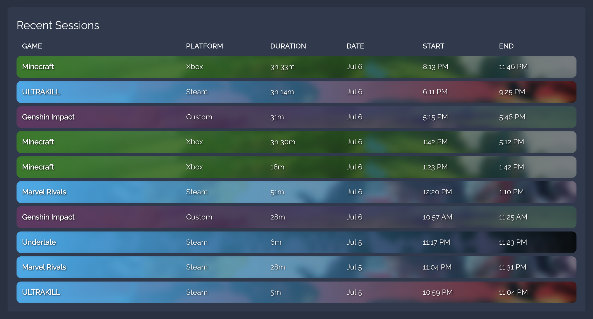

---

### 8. Gaming Status - Game Management
A utility card for cleaning up mislabeled or unwanted play history. Rename a game across a player's stored history (merging it into an existing name if one matches), permanently purge every trace of a game (sessions, daily/weekly totals, and archived per-day breakdowns), delete or reassign an individual session, or manually backfill a session that was never tracked.

Unlike the other cards, Platform/Game/Rename/Delete are chosen live on the card itself rather than configured in YAML. The editor only controls which player(s) the card can act on.

**UI Configuration Options:**
* **Card Title:** Optional title displayed above the card.
* **Player Filter:** **All Players** shows a player picker directly on the card; **Single Player** pins the card to one player and hides the picker.
* **Platform (on the card):** Defaults to **All Platforms** (acts across every platform this player has data on). Pick a specific platform to scope the action to just that platform's history.
* **Game (on the card):** A dropdown of every game found in the selected player/platform's history, labeled with total recorded playtime.
* **Rename:** Type a new name and click **Rename**. Only enabled once a game is selected and the new name is non-empty and different from the current name.
* **Delete:** Type the exact game name into the confirmation field to enable the **Delete** button. This permanently removes all history for that game and cannot be undone.
* **Delete Session:** Once a game is selected, a session picker lists that game's individually recorded sessions (newest first). Pick one and click **Delete Session** to remove just that single session (correcting only its contribution to daily/weekly/lifetime totals) without touching any other session of the same game. *Only sessions still present in the platform's recent-session history can be targeted this way; once a session ages out into the archived daily totals, only the whole-game **Delete** remains available for it.*
* **Reassign Session:** Right below the session picker, choose a destination **player** and **platform** (the platform list is scoped to whatever that player actually has configured) and click **Reassign** to move the selected session to them instead — corrects totals on both ends. Useful when a session was tracked under the wrong person's profile, e.g. the wrong account signed into a shared Xbox/Steam app or console.
* **Add Session:** Available as soon as a specific platform (not **All Platforms**) is selected, independent of any game selection. Enter a game title and a start/end time (a live duration preview appears once both are set) and click **Add Session** to manually backfill history that was never tracked — e.g. play that happened while the integration was offline, or a title that wasn't detected.

---

## Advanced Configuration (Manual Entities / Selected Players)

By default, all cards are entirely plug-and-play. They automatically scan your Home Assistant instance for any sensors generated by the Gaming Status integration (and Plex/Tautulli, if enabled) and populate the UI.

The **List** and **Slideshow** cards feature a **Manual Entities** override in their Advanced section. The **Weekly Hours**, **Platforms**, **Leaderboard**, **Weekly Games**, and **Recent Sessions** cards use a **Player Filter** setting instead, with a **Selected Players** option that reveals the same kind of field.

In both cases, just enter a comma-separated list of **player names** — e.g. `adam, josh, liv` — no need to look up or type full entity IDs. Full entity IDs are still accepted too (handy for non-gamer entities like Plex sessions below, or in the rare case a name is ambiguous), and any entry that doesn't match a known player name or an existing entity is silently ignored rather than causing an error.

**How Manual Entities interact with Plex (Slideshow card):**
* **To restrict both gamers AND Plex sessions:** Set the Plex Integration to **None**, and manually type out only the gamers and Plex session sensors you want to see (e.g., `adam, sensor.plex_session_1_tautulli`). The card will automatically format the Tautulli text bubbles correctly.
* **To restrict gamers but show ALL Plex sessions:** Type your specific gamers into the Manual Entities box (e.g., `adam, josh`), and set Plex Integration to **Tautulli** or **Plex**. The card will restrict the gaming sensors to your list, but automatically sweep up every active Plex session on your network.

---

## YAML Reference
For advanced users who prefer to write YAML, here are the base configurations for each card:

**The List Card:**
```yaml
type: custom:gaming-status-card
title: The Squad # Can be left blank to omit the title
mode: all # Options: all, online, pc, custom, discord, steam, xbox, playstation, playnite
sort_by: last_online # Options: last_online, name, state
show_badges: true
show_text_shadow: true
color_mode: game # Options: game, platform
offline_image: game # Options: game, avatar
max_visible_players: " " # Limit visible rows before scrollbar appears
manual_entities: " " # Whitelist of comma-separated player names or entity IDs
```

**The Slideshow Card:**
```yaml
type: custom:gaming-slideshow-card
artwork_type: hero # Options: hero, cover, logo, icon
aspect_ratio: " " # Leave blank to use the default for your artwork type
time_per_slide: 5 # Display time for each slide (seconds)
transition_time: 1 # Transition time (seconds)
show_avatars: true
auto_hide: true
plex_source: none # Options: none, plex, tautulli
manual_entities: " " # Whitelist of comma-separated player names or entity IDs
```

**The Weekly Hours Card:**
```yaml
type: custom:gaming-status-chart-card
title: Weekly Playtime
window: rolling # Options: rolling, calendar
mode: all # Options: all, single, selected
single_entity: " " # A single sensor ID (used when mode is 'single')
selected_entities: " " # Comma-separated player names or entity IDs (used when mode is 'selected')
custom_colors: " " # Override the default colors
show_legend: true # Set to false to hide the player legend and give more space to the chart
hide_empty: false # Set to true to exclude players with no hours in the selected window
```

**The Platforms Card:**
```yaml
type: custom:gaming-status-donut-card
title: Platform Split
window: rolling # Options: rolling, calendar
mode: all # Options: all, single, selected
single_entity: " " # A single sensor ID (used when mode is 'single')
selected_entities: " " # Comma-separated player names or entity IDs (used when mode is 'selected')
custom_colors: " " # Override the default colors (Xbox, PlayStation, PC)
show_legend: true # Set to false to hide the platform legend; legend wraps automatically on narrow screens when shown
show_total: true # Set to false to hide the grand total playtime line
```

**The Leaderboard Card:**
```yaml
type: custom:gaming-status-leaderboard-card
title: Gaming Leaderboard
metric: hours # Options: hours, longest, games, game_hours, all_time_hours, all_time_sessions, all_time_top_games
window: rolling # Options: rolling, calendar
mode: all # Options: all, single, selected
single_entity: " " # A single sensor ID (used when mode is 'single')
selected_entities: " " # Comma-separated player names or entity IDs (used when mode is 'selected')
max_players: 3 # Number of ranked rows to display
custom_colors: " " # Override the default colors
```

**The Weekly Games Card:**
```yaml
type: custom:gaming-status-game-chart-card
title: Weekly Games
window: rolling # Options: rolling, calendar
mode: all # Options: all, single, selected
entity: " " # A single sensor ID (used when mode is 'single')
selected_entities: " " # Comma-separated player names or entity IDs (used when mode is 'selected')
max_games: 6 # Number of top games to display
custom_colors: " " # Override the default colors
show_legend: true # Set to false to hide the game title legend; column count adapts to available width when shown
```

**The Recent Sessions Card:**
```yaml
type: custom:gaming-status-recent-sessions-card
title: Recent Sessions
show_platform_steam: true # Uncheck any of these to exclude that platform's sessions
show_platform_xbox: true
show_platform_playstation: true
show_platform_playnite: true
show_platform_custom: true
show_platform_discord: true
mode: all # Options: all, single, selected
single_entity: " " # A single sensor ID (used when mode is 'single')
selected_entities: " " # Comma-separated player names or entity IDs (used when mode is 'selected')
max_sessions: 10 # Number of sessions to display (max 20); scrolls once more than 10 are shown
background: art # Options: art (game artwork), avatar (player avatar), none
color_mode: game # Options: game (dynamic, colored from each session's own game), platform (fixed per-platform brand color)
show_header: true # Set to false to hide the column header row
show_column_player: true # Automatically hidden when mode is 'single', regardless of this setting
show_column_game: true
show_column_platform: true
show_column_duration: true
show_column_date: true
show_column_start: true
show_column_end: true
```

**The Game Management Card:**
```yaml
type: custom:gaming-status-game-management-card
title: Game Management
mode: all # Options: all, single
single_entity: " " # A single player's master sensor ID (used when mode is 'single')
```
